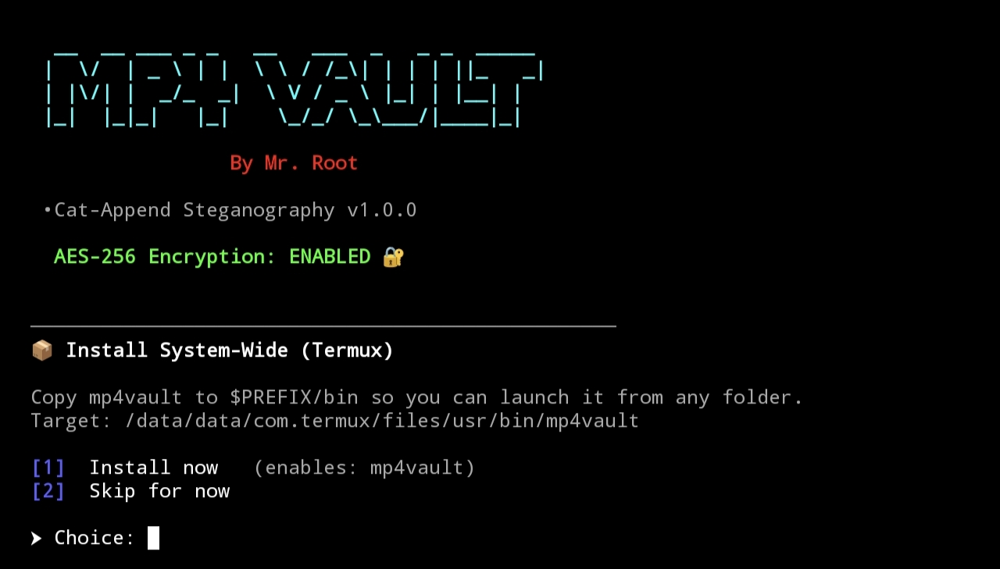
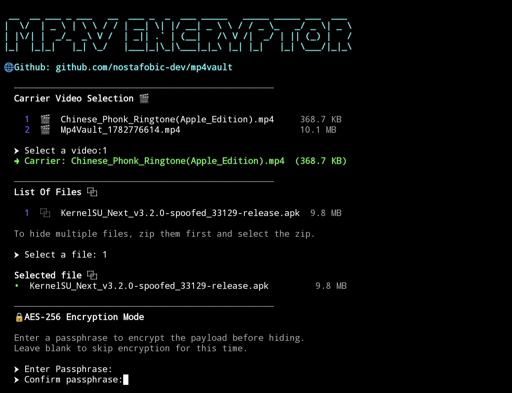
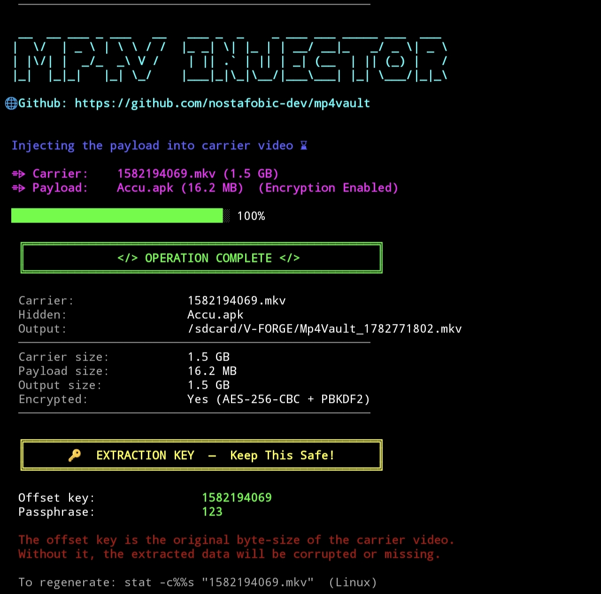
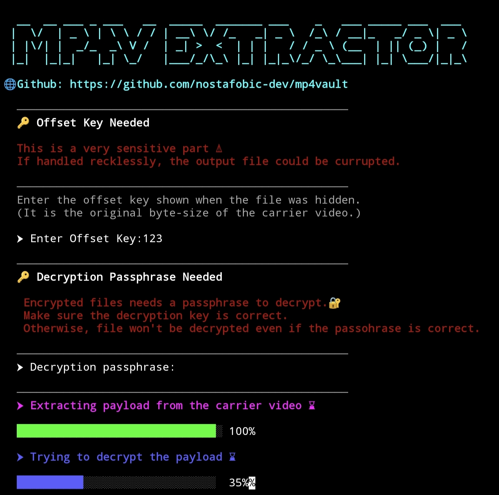

<div align="center">

## Mp4Vault 🔐

**Exploit Google Photos Unlimited Storage. Hide files inside videos. Extract them back out—Encrypt them in between.**

A self-contained, interactive Bash CLI for byte-append steganography —
no dependencies beyond standard Unix tools, runs on Linux, macOS, and Android (Termux).


<!-- Replace this line with a demo GIF — record one with `vhs` or `asciinema` and drop it here.
     A 5-second clip of the hide/extract flow does more for this README than any paragraph of text. -->

</div>

---

## Table of Contents

- [Overview](#overview)
- [Screenshots](#screenshots)
- [How It Works](#how-it-works)
- [Features](#features)
- [Requirements](#requirements)
- [Installation](#installation)
- [Usage](#usage)
- [Configuration](#configuration)
- [Security & Limitations](#security--limitations)
- [Usage Case](#usage-case)
- [Contributing](#contributing)
- [License](#license)

---

## Overview

**Mp4Vault** is an interactive command-line tool that hides any file inside a video
file by appending it to the end of the video's data, and can later pull that file
back out again. The payload can optionally be encrypted with **AES-256-CBC** before
it's hidden, so even if someone finds it, they can't read it without your passphrase.

Everything runs through a guided menu — no flags to memorize, no manual byte-math.

Navigate to [Usage](#usage) and [Usage Case](#usage-case) for more details.

## Screenshots

### Mode Selection



### Mode-1: Hide files

#### Encrypt Files


#### Injector



## Mode-2: Extractor/Decryptor



## How It Works

Mp4Vault uses a technique sometimes called **cat-append steganography**:

1. The payload (your file, optionally encrypted) is appended directly onto the end
   of a carrier video file.
2. Most video players and parsers stop reading once they reach the end of the
   actual video stream, so the carrier still plays completely normally —
   the extra bytes just ride along, invisible to anything that isn't looking for them.
3. To get the payload back out, Mp4Vault needs to know exactly where the
   original video ended. That number — the carrier's original byte size — is
   your **Offset Key**, and it's printed once, right after you hide a file.

> **Be honest with yourself about what this is.** This is concealment, not
> cryptographic-grade steganography. It doesn't hide data inside the video's
> pixels or audio samples — it just tacks data onto the end of the file. The file
> size increases by exactly the payload size, and that's trivially detectable by
> anyone who checks. Encryption (which Mp4Vault offers) protects the *contents*
> if discovered; it does not hide the *fact* that something was appended.

## Features

- 🎬 Hide any file type inside any video file — no transcoding, no quality loss
- 🔐 Optional AES-256-CBC + PBKDF2 encryption of the payload before hiding
- 🖥️ Fully interactive, menu-driven — pick options by number, no CLI flags
- 📱 Cross-platform: Linux, macOS, and Android via Termux
- 📦 Auto-detects missing dependencies and offers to install them (apt / pkg / pacman / dnf / brew)
- ⚡ One-time system-wide install on Termux — launch with just `mp4vault` from anywhere
- 📋 Paginated file browser with human-readable sizes
- 🛡️ Built-in guards: disk space checks, overwrite confirmation, can't accidentally clobber the carrier video

## Requirements

| Tool | Required? | Purpose |
|------|-----------|---------|
| `bash` 4.3+ | ✅ Required | Uses namerefs (`local -n`) |
| `file` | ✅ Required | Detects video files by MIME type |
| `realpath` (coreutils) | ✅ Required | Path resolution |
| `awk` | ✅ Required | Progress bars, math, formatting |
| `openssl` | ✅ Required | AES-256 encryption / decryption |
| `figlet` | ✅ Required | ASCII-art banners |

Missing tools are detected automatically on first run, and VaultForge will offer
to install them for you via whichever package manager it finds.

## Installation

### Linux / macOS

```bash
git clone https://github.com/nostafobic-dev/mp4vault.git
cd mp4vault
chmod +x mp4vault.sh
./mp4vault.sh
```

> **macOS note:** the system `bash` is version 3.2, which is too old. Install a
> newer one and run with it explicitly:
> ```bash
> brew install bash
> /opt/homebrew/bin/bash mp4vault.sh   # Apple Silicon
> /usr/local/bin/bash mp4vault.sh      # Intel
> ```

### Termux (Android)

```bash
pkg update -y && pkg upgrade -y
termux-setup-storage
pkg install git -y
git clone https://github.com/nostafobic-dev/mp4vault.git
cd mp4vault
chmod +x mp4vault.sh
./mp4vault.sh
```

On first run inside Termux, VaultForge will offer to copy itself into
`$PREFIX/bin` so you can launch it from any folder afterward just by typing:

```bash
mp4vault
```

## Usage

Run the script and follow the prompts:

**To hide a file:**
1. Choose mode `[1] Hide file(s) inside a video`
2. Pick a folder to scan, then select a carrier video from the list
3. Select the file you want to hide (zip it first if it's more than one file)
4. Optionally set a passphrase to encrypt it
5. Choose an output location and filename
6. **Save the Offset Key (and passphrase, if used) that Mp4Vault prints.**
   Without the Offset Key, the hidden file cannot be recovered.

**To extract a file:**
1. Choose mode `[2] Extract hidden file from a video`
2. Select the video containing the hidden payload
3. Enter the Offset Key (and passphrase, if it was encrypted)
4. Choose where to save the recovered file

## Configuration

Default behavior can be changed by editing the config block near the top of
`mp4vault.sh`:

| Variable | Default | Description |
|----------|---------|--------------|
| `CONFIG_FILE` | `${HOME}/.mp4vault.conf` | Saves important info |
| `ENCRYPT_PAYLOAD` | `true` | Offer AES-256 encryption before hiding by default |
| `SHOW_SIZES` | `true` | Show file sizes next to filenames in lists |
| `PAGE_SIZE` | `20` | Files shown per page before pagination |
| `VERBOSE` | `true` | Print extra diagnostic messages |

## Security & Limitations

- The **Offset Key** isn't a secret by itself (it's just a file size), but it's
  *required* for correct extraction — losing it means losing the hidden file,
  even if you remember the passphrase.
- Without encryption enabled, anyone who has the carrier file and the offset
  can recover the hidden file with nothing more than `tail -c`.
- This technique is detectable by simple means (file size comparison, inspecting
  the end of the file). Treat it as casual concealment, not forensic-proof hiding.
- **MKV/WebM** containers are more likely to reject files with trailing appended
  data than **MP4/MOV** — VaultForge warns you, but MP4/MOV is the safer carrier choice.
- Use responsibly, and don't rely on this as your only copy of anything important —
  always keep a separate backup of files before hiding them.

## Usage Case

I created this tool out of curiosity, but it quickly became a useful solution for my personal file backup workflow.

The main goal of this project is to provide a free and secure way to backup important files by hiding them inside media files.

You might ask:

«Why hide a file inside a video?»

The reason is an interesting behavior I discovered in Google Photos.

If you append a file to an image or video without encryption and upload it to Google Photos, the extra data may be removed because the service processes the file based on its actual media structure.

However, if the hidden file is encrypted first, Google Photos treats the additional data as part of the media file and keeps it intact.

⚠️ Limitations

There is one major limitation: Google Photos has upload size restrictions for photos and videos.

- 🖼️ Images (".jpg", ".png"): around 500 MB upload limit
- 🎥 Videos (".mkv"): supports much larger uploads (tested successfully with 10 GB+ files)

Because of this, videos are the preferred container format for this tool.

🚀 Backup Method

For users with unlimited Google Photos storage, this can act as a long-term backup method:

1. Take a normal ".mkv" video file (for example, 1 GB)
2. Use this tool to encrypt and inject your files into the video
3. Upload the generated video to Google Photos
4. When needed, download the video
5. Use the extraction process to recover your original files

Your files remain hidden inside the video while being stored as a normal media file.

🔐 Why Encryption?

Encryption ensures the hidden data is not detected or removed during upload processing. The encrypted payload becomes indistinguishable from normal binary data attached to the media file.

This makes the method useful for storing:

- Personal backups
- Archives
- Important documents
- Private files

📦 Tested

- ✅ Image/video container method
- ✅ Encrypted file injection
- ✅ Extraction after upload/download cycle
- ✅ Tested with ZIP archives up to 10 GB+

This project is intended as a simple, free backup technique using existing cloud storage.

## Contributing

Issues and pull requests are welcome. If you're submitting a PR:

1. Fork the repo and create a branch (`git checkout -b feature/your-feature`)
2. Test your changes on at least one supported platform
3. Run [`shellcheck`](https://www.shellcheck.net/) against the script before submitting
4. Open a PR describing what changed and why

## License

Distributed under the **MIT License**. See [`LICENSE`](LICENSE) for the full text.

---

<div align="center">
<sub>Built by <a href="https://github.com/nostafobic-dev">Mr. Root</a></sub>
</div>

